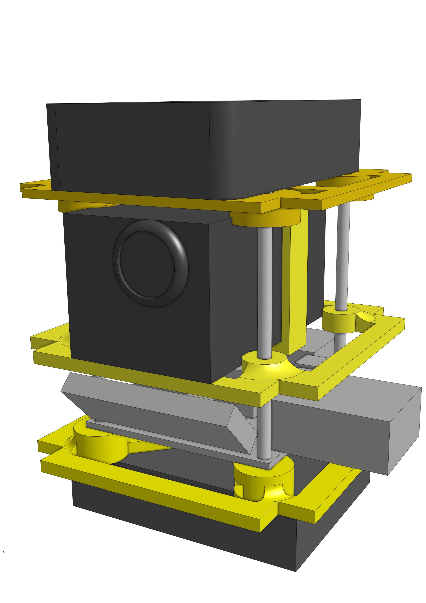
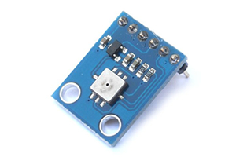
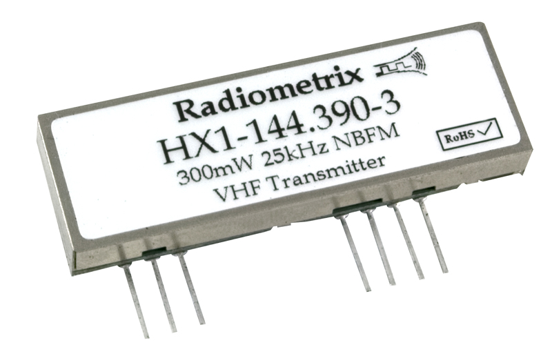
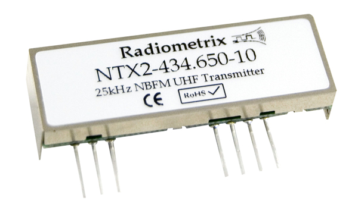

# WIP hispatracker

An Arduino based project for High Altitude Ballooning. APRS tracker, 2xGPS, temperature and pressure. It still lacks SD logging and an external temperature sensor as the sketch was running out of memory. We are working in a improved version with the atmega1284p-pu to achieve this goals (and maybe some more).

## Sensors and libraries in use

### GPS and Altitude: Ublox Neo6M
We strongly recommend to use SlashDevin's [NeoGPS](https://github.com/SlashDevin/NeoGPS) library for its low memory footprint and awesome documentation. The alternative, TinyGPS is too heavy for most applications in a common Arduino (atmega328p-pu).

Our GPS is the Ublox Neo-6m with a performance of 50.000 meters (yes, 50 km) of altitude, 2.5 meters of accuracy and works at 3.3v

### BMP085 Temperature, altitude and pressure sensor

Good compromise between price and capabilities but with a altitude limit of 9000 meters over the sea (27000 feet). It works at 3.3v

### RF Transmission: Radiometrix HX1

We think that maybe this was a mistake. It has a usable range over 10km and a consumption of 140mA. It has a transmit power of 300mW so you probably need HAM license to use it. Also it works at 5v, being the only module with this voltage needs, it has introduce a need of raising the VIN to, at least 6v so that we provide a regulated supply of 5v to the Radio and 3.3v to the rest of the module. Also it has force us to use a logic level converter to communicate to it. 

The good part is that it was the only able to transmit at 144.800 to use the APRS network. So we can use the network to track our payload with webs like [aprs.fi](http://aprs.fi).

The alternative was to use the NTX2 transmitter. This transmitter is license free with a usable range of 500m (thats a 5% of the power of the HX1). It just transmits on 434.075MHz, 434.650MHz and 458.700MHz so it's not in the APRS network. It has a voltage regulator and you can feed it with 3.3 volts. We'll play with it in the future.

### Arduino Pro Mini 3.3v

Finally, our brain is controlled by an Arduino Pro Mini running at 3.3v

### PCB
Our PCB has been specifically design to fit our needs. You'll find the files in the eagle folder. The PCB has been produce in Seeedstudio. It's 5x5 cm.

### Hardware

Check the [docs](docs) folder. We have used a Prusa i3 3D printer to build the frame of the probe. Basically supports for the batteries, camera, PCB and GPS tracker. STL's will be available in the hardware folder soon as well as in Thingiverse.

The supports are 7x7cm with holes to support the PCB of 5x5cm. In our first tests it reaches a height of 107mm.